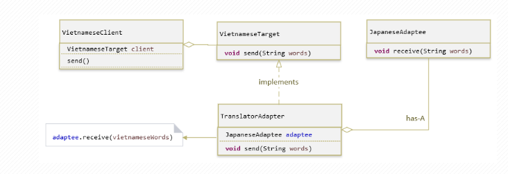

### Welcome to Design Pattern

#### List Patterns
- Solid
  - Single Responsibility Principle
    - A class should only have one reason to change
    - Separation of concerns - different classes handling different, independent tasks/problems
  - Open-Closed Principle
    - Classes should be open for extension but closed for modification
  - Liskov Substition Principle
    - You should be able ti substitute a base type for a subtype
  - Interface Segregation Principle
    - Don't put too much into an interface, split into separate interfaces
    - YAGNI - You Ain't Going to Need It
  - Dependency Inversion Principle
    - High level modules should not depend upon low-level ones, user abstractions
- Creation
  - Builder
    - Some  are simple and can be created in s single constructor call
    - Other objects require a lot of ceremony to create
    - Having an object with 10 constructor arguments is not productive
    - Instead, opt for piecewise construction
    - Builder providers an API for constructing an object step-by-step
  - Factories
    - Abstract Factory
      - A factory can take care of object creation
      - A factory can be external or reside inside the object as an inner class
    - Factory Method
      - Is a static method that creates objects
  - Prototype
    - To implement a prototype, partially construct an object and store it somewhere
    - Clone the prototype
      - Implement your own deep copy functionality or
      - Serialize and deserialize
    - Customize the resulting instance
  - Singleton
    - A component which is instantiated only once
    - Making a safe singleton is easy: construct a static Lazy<T> and return its Value
- Structural
  - Adapter
    - A construct which adapts an existing interface X to conform to the required interface Y
    - Implementing an Adapter is easy
    - Determine the API you have and the API you need
    - Create a component which aggregates (has a reference to, ...) the adaptee
    - Intermediate representations can pile up: user caching and other optimizations
  - Bridge
    - couple abstraction from implementation
    - Both can exist as hierarchies
    - A stronger form of encapsulation
  - Composite
    - Objects can use other objects via inheritance/composition
    - Some composed and singular objects need similar/identical behaviours
    - Composite design pattern lets us treat both types of objects uniformly
    - Java supports container iteration with the Iterable<T> interface
    - A single object can masquerade as a collection by returning a single-element
      collection containing only this
  - Decorator
    - Facilitates the addition of behaviors to individual objects without inheriting from example
    - A decorator keeps the reference to the decorated objects
    - May or may not forward calls
  - Facade
  - Flyweight
  - Proxy
- Behavioural
  - Chain of Responsibility
  - Command
  - Interpreter
  - Iterator
  - Mediator
  - Memento
  - Null Object
  - Observer
  - State
  - Strategy
  - Template Method
  - Visitor

-----------------------------------------------------------------------
#### Diagram patterns
- Adapter
